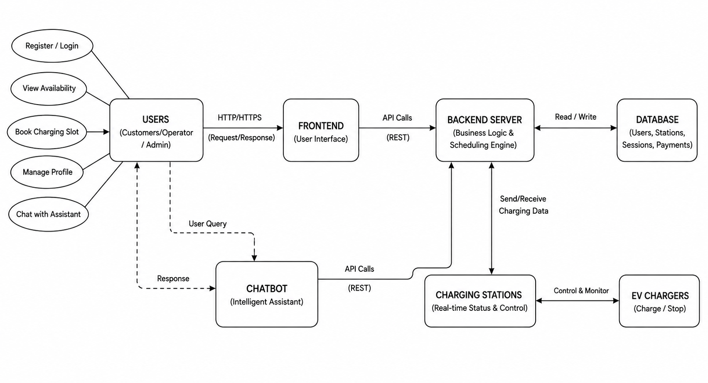

# SmartCharge

## Intelligent EV Charging Station Resource Management and Scheduling System

SmartCharge is an intelligent EV charging station management and scheduling system designed to efficiently manage limited charging resources and concurrent charging requests.

The project combines **Operating System (OS)** and **Database Management System (DBMS)** concepts to provide conflict-free charger allocation, request scheduling, concurrency management, and resource utilization.

---

## Problem Statement

With the increasing adoption of electric vehicles, charging stations may face:

- Limited charger availability
- Long waiting times
- Multiple simultaneous charging requests
- Booking conflicts and double-booking
- Inefficient charger utilization
- Different priority levels among charging requests

Traditional booking systems mainly store reservations but do not effectively demonstrate scheduling, concurrency control, and resource allocation.

SmartCharge addresses these challenges by treating charging requests as competing processes for limited charger resources.

---

##  Objectives

The main objectives of SmartCharge are:

- Manage EV charging requests efficiently.
- Allocate limited chargers without conflicts.
- Implement OS-based scheduling algorithms.
- Handle multiple simultaneous requests.
- Prevent charger double-booking.
- Demonstrate database transactions and locking.
- Compare different scheduling algorithms.
- Provide an interactive user interface.
- Provide an intelligent chatbot for user assistance.
- Monitor charger and charging-session status.

---

## Core Concepts

### Operating System Concepts

SmartCharge applies the following OS concepts:

- Process Scheduling
- FCFS Scheduling
- Priority Scheduling
- Shortest Job First (SJF)
- Threads
- Synchronization
- Mutex / Locks
- Semaphores
- Resource Allocation
- Concurrent Request Handling

### DBMS Concepts

The system demonstrates:

- ER Modeling
- Relational Database Design
- Normalization
- SQL
- Transactions
- ACID Properties
- Concurrency Control
- Row-Level Locking
- Commit and Rollback
- Database Recovery
- Data Consistency

---
## System Architecture

The SmartCharge system follows a layered architecture consisting of users, frontend interface, backend server, database, chatbot, charging stations, and EV chargers.

The **frontend** provides the user interface through which customers, operators, and administrators interact with the system. Requests are sent to the **backend server** through REST API calls.

The **backend server** contains the core business logic and scheduling engine. It communicates with the database for storing and retrieving users, charging stations, charging sessions, and payment information.

The system also integrates a **chatbot** that allows users to make queries and receive information through an intelligent assistant. The backend communicates with charging stations to receive real-time charging data and control charger operations.

### Architecture Diagram



##  Chatbot

SmartCharge includes an intelligent chatbot as an additional user-assistance interface.

The chatbot can assist users with:

- Charger availability
- Charging request status
- Estimated waiting time
- Station information
- Basic system navigation
- Charging-related queries

The chatbot communicates with the backend and retrieves relevant system information.

The chatbot does not directly bypass the scheduling and database transaction mechanisms. Charger allocation is still handled by the scheduling and resource-management modules.

---

##  System Workflow

```text
User
  ↓
Frontend / Chatbot
  ↓
Backend Server
  ↓
Charging Request
  ↓
Pending Queue
  ↓
OS Scheduler
  ↓
FCFS / Priority / SJF
  ↓
Check Charger Availability
  ↓
Database Transaction
  ↓
Lock Charger
  ↓
Create Charging Session
  ↓
Update Charger Status
  ↓
Charging Session
  ↓
Release Charger
  ↓
Schedule Next Request
